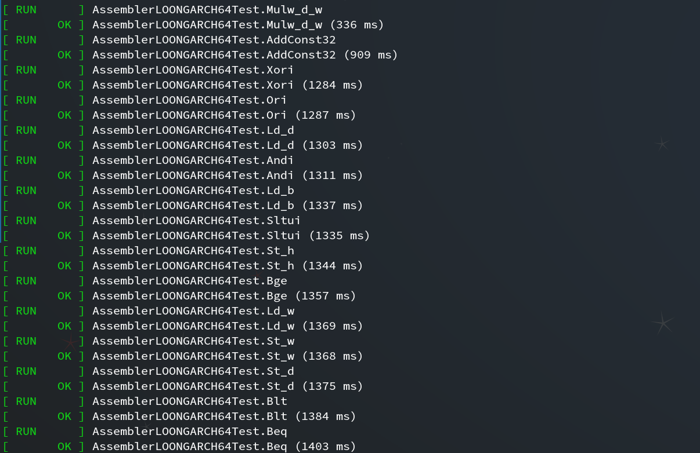
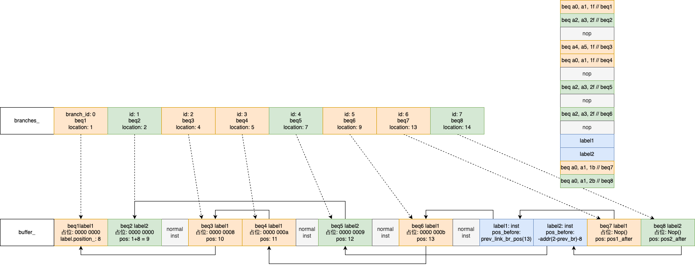

<div class="middle center">
<div style="width: 100%">

# 2024 年度总结
<hr/>

By [朱奇正](https://github.com/baibaidashixiong)

<div style="text-align: right; margin-top: 1em;">
<p>2024.1.9&emsp;&emsp;&emsp;</p>
</div>
</div>
</div>

<!--s-->

<div class="middle center">
<div style="width: 100%">

# 目录 
<hr/>
1. 完成JNI/汇编器(1~4月)<br>
2. 代码生成器(7~10月)<br>
3. debug(11月~现在)<br>

</div>
</div>


<!--s-->

<div class="middle center">
<div style="width: 100%">

# Part.1 
<hr/>
完成JNI/汇编器

</div></div>
<!--v-->
## &nbsp;&nbsp;&nbsp;&nbsp;完成JNI

- 设置通用入口点
  - art_quick_generic_jni_trampoline
    - jni trampoline

```mermaid
                                   +--> lookup stub(for lazy load)
                                   |
art_quick_generic_jni_trampoline --+--> native code
                                   |
                                   +--> jni_trampoline --> native code
```


<!--v-->

## &nbsp;&nbsp;&nbsp;完成JNI

- JNI Compiler

```java [1-3|4-5|6-7|9-17|19-20]
// 1. Build the frame saving all callee saves, Method*, and PC return address.
//    For @CriticalNative, this includes space for out args, otherwise just the managed frame.
  __ BuildFrame(current_frame_size, method_register, callee_save_regs);
// 2. Write out the end of the quick frames.
  __ StoreStackPointerToThread(Thread::TopOfManagedStackOffset<kPointerSize>());
// 3. Move frame down to allow space for out going args.
  __ IncreaseFrameSize(main_out_arg_size);
...
// 8. Create 1st argument, the JNI environment ptr.
// Register that will hold local indirect reference table
  if (main_jni_conv->IsCurrentParamInRegister()) {
    ManagedRegister jni_env = main_jni_conv->CurrentParamRegister();
    __ LoadRawPtrFromThread(jni_env, Thread::JniEnvOffset<kPointerSize>());
  } else {
    FrameOffset jni_env = main_jni_conv->CurrentParamStackOffset();
    __ CopyRawPtrFromThread(jni_env, Thread::JniEnvOffset<kPointerSize>());
  }
...
// 18. Finalize code generation
  __ FinalizeCode();
```
<!--v-->
## &nbsp;&nbsp;&nbsp;&nbsp;完成汇编器

- Compiler Test(Based on GTEST)

```c++
template <typename EmitOp>
  void TestAddConst(const std::string& test_name,
                    size_t bits,
                    const std::string& suffix,
                    EmitOp&& emit_op) {
    int64_t kImm12s[] = {
        0, 1, 2, 0xff, 0x100, 0x1ff, 0x200, 0x3ff, 0x400, 0x7ff,
        -1, -2, -0x100, -0x101, -0x200, -0x201, -0x400, -0x401, -0x800,
    };
    int64_t kSimplePositiveValues[] = {
        0x800, 0x801, 0xbff, 0xc00, 0xff0, 0xff7, 0xff8, 0xffb, 0xffc, 0xffd, 0xffe,
    };
    int64_t kSimpleNegativeValues[] = {
        -0x801, -0x802, -0xbff, -0xc00, -0xff0, -0xff8, -0xffc, -0xffe, -0xfff, -0x1000,
    };
    std::vector<int64_t> large_values = CreateImmediateValuesBits(bits, /*as_uint=*/ false);
    auto kept_end = std::remove_if(large_values.begin(),
                                   large_values.end(),
                                   [](int64_t value) { return IsInt<13>(value); });
    large_values.erase(kept_end, large_values.end());
    large_values.push_back(0xfff);

    std::string tmp_name = GetRegisterName(TMP);

    std::string expected;
    for (XRegister* rd : GetRegisters()) {
      std::string rd_name = GetRegisterName(*rd);
      std::string addi_rd = "addi." + suffix + " " + rd_name + ", ";
      std::string add_rd = "add." + suffix + " " + rd_name + ", ";
      for (XRegister* rs1 : GetRegisters()) {
        // TMP can be the destination register but not the source register.
        if (*rs1 == TMP) {
          continue;
        }
        std::string rs1_name = GetRegisterName(*rs1);

        for (int64_t imm : kImm12s) {
          emit_op(*rd, *rs1, imm);
          expected += addi_rd + rs1_name + ", " + std::to_string(imm) + "\n";
        }

        auto emit_simple_ops = [&](ArrayRef<const int64_t> imms, int64_t adjustment) {
          for (int64_t imm : imms) {
            emit_op(*rd, *rs1, imm);
            expected += addi_rd + rs1_name + ", " + std::to_string(adjustment) + "\n" +
                        addi_rd + rd_name + ", " + std::to_string(imm - adjustment) + "\n";
          }
        };
        emit_simple_ops(ArrayRef<const int64_t>(kSimplePositiveValues), 0x7ff);
        emit_simple_ops(ArrayRef<const int64_t>(kSimpleNegativeValues), -0x800);

        for (int64_t imm : large_values) {
          emit_op(*rd, *rs1, imm);
          expected += "li.d " + tmp_name + ", " + std::to_string(imm) + "\n" +
                      add_rd + rs1_name + ", " + tmp_name + "\n";
        }
      }
    }
    DriverStr(expected, test_name);
  }
```

<!--v-->
## &nbsp;&nbsp;&nbsp;&nbsp;完成汇编器

- Compiler Test(Based on GTEST)
<div style="text-align: center;">
<br/>

</div>

<!--v-->
## &nbsp;&nbsp;&nbsp;&nbsp;完成汇编器

- Linker
  - Emit - Reverse(nop) - Relocate
<div style="text-align: center;">
<br/>

</div>

<!--v-->

## 标题

<div class="three-line">

|表头 a|表头 b|表头 c|
|:--:|:--:|:--:|
|这是一个|一些内容|...|
|三线表|...|...|

</div>

|表头 a|表头 b|表头 c|
|:--:|:--:|:--:|
|这是一个|一些内容|...|
|普通表格|...|...|

<!--s-->

<div class="middle center">
<div style="width: 100%">

# Part.2 布局

</div>
</div>

<!--v-->

## 多列布局

<div class="mul-cols">
<div class="col">

第一列

- list
- list

</div>
<div class="col">

第二列

```python
class MyClass:
    def __init__(self, ...):
        ...
    def method(self, ...):
        ...
```

</div>
</div>

<div class="mul-cols">
<div class="col">

第一列

- list
- list

</div>
<div class="col">

第二列

1. list 
2. list 
    - list

</div>
<div class="col">

第三列

```python
class MyClass:
    def __init__(self, ...):
        ...
    def method(self, ...):
        ...
```

</div>
</div>
